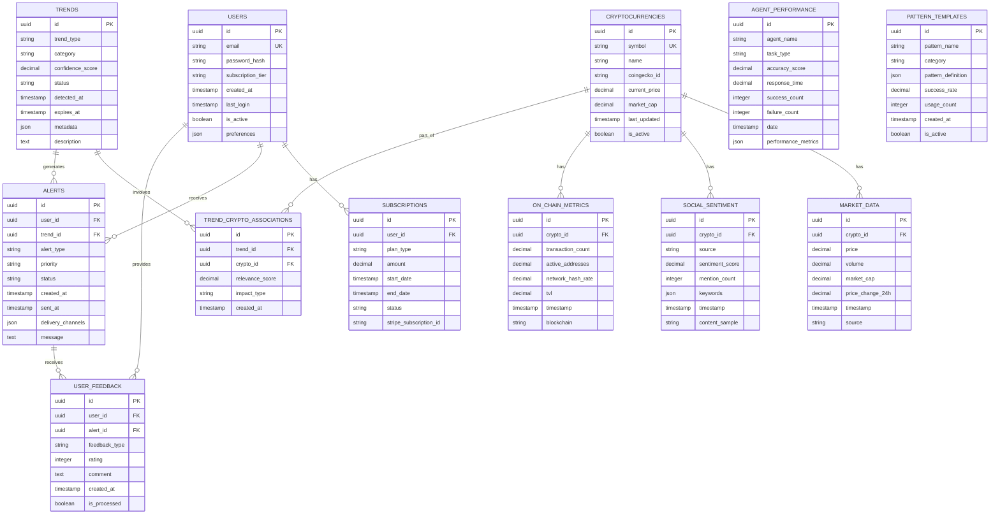
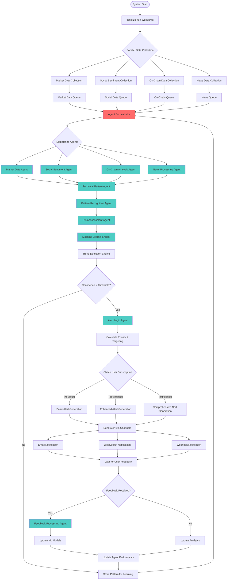
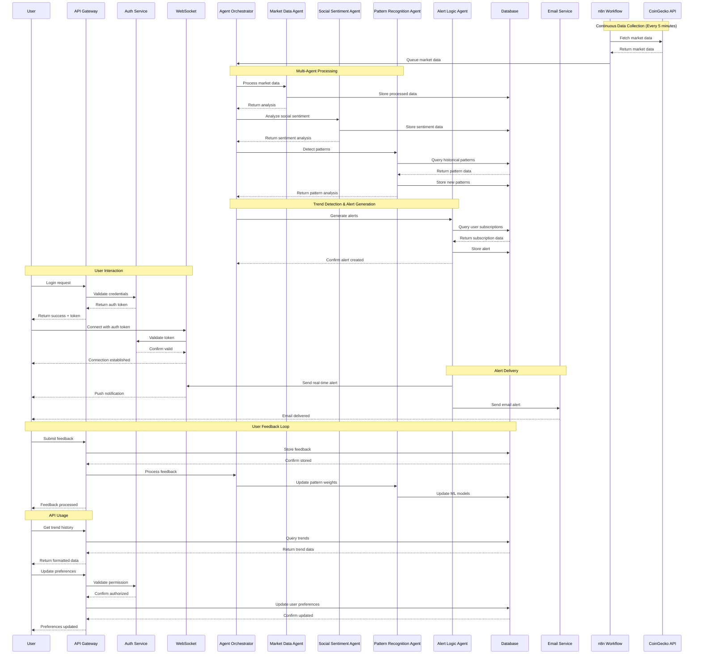

## 1. System Context Diagram

```mermaid
graph TB
    subgraph "External Systems"
        CG[CoinGecko API]
        SM[Social Media APIs<br/>Twitter, Reddit, Discord]
        BC[Blockchain APIs<br/>Etherscan, BSC, etc.]
        NEWS[News APIs<br/>CryptoPanic, etc.]
        PAYMENT[Payment Gateway<br/>Stripe/PayPal]
        EMAIL[Email Service<br/>SendGrid/AWS SES]
    end

    subgraph "Core Platform"
        subgraph "Data Layer"
            N8N[n8n Workflow Engine]
            DB[(PostgreSQL Database)]
            REDIS[(Redis Cache)]
            QUEUE[Message Queue<br/>Bull/Redis]
        end

        subgraph "Multi-Agent Framework"
            ORCHESTRATOR[Agent Orchestrator]
            MDA[Market Data Agent]
            SSA[Social Sentiment Agent]
            PRA[Pattern Recognition Agent]
            OCA[On-Chain Analysis Agent]
            NPA[News Processing Agent]
            ALA[Alert Logic Agent]
            RLA[Risk Assessment Agent]
            MLA[Machine Learning Agent]
            TPA[Technical Pattern Agent]
            FFA[Feedback Processing Agent]
        end

        subgraph "API Layer"
            API[FastAPI/Express API]
            AUTH[Authentication Service]
            WEBSOCKET[WebSocket Service]
        end

        subgraph "Business Logic"
            TREND[Trend Detection Engine]
            ALERT[Alert Generation]
            FEEDBACK[Feedback Loop System]
            ANALYTICS[Analytics Engine]
        end
    end

    subgraph "Client Applications"
        WEB[Web Dashboard]
        MOBILE[Mobile App]
        API_CLIENTS[API Clients]
        WEBHOOK[Webhook Endpoints]
    end

    subgraph "Infrastructure"
        CDN[CDN<br/>CloudFlare]
        MONITOR[Monitoring<br/>DataDog/New Relic]
        BACKUP[Backup Service]
        DEPLOY[CI/CD Pipeline]
    end

    CG --> N8N
    SM --> N8N
    BC --> N8N
    NEWS --> N8N
    N8N --> QUEUE
    QUEUE --> ORCHESTRATOR
    
    ORCHESTRATOR --> MDA
    ORCHESTRATOR --> SSA
    ORCHESTRATOR --> PRA
    ORCHESTRATOR --> OCA
    ORCHESTRATOR --> NPA
    ORCHESTRATOR --> ALA
    ORCHESTRATOR --> RLA
    ORCHESTRATOR --> MLA
    ORCHESTRATOR --> TPA
    ORCHESTRATOR --> FFA
    
    MDA --> DB
    SSA --> DB
    PRA --> DB
    OCA --> DB
    NPA --> DB
    
    ORCHESTRATOR --> TREND
    TREND --> ALERT
    ALERT --> WEBSOCKET
    ALERT --> EMAIL
    
    WEB --> API
    MOBILE --> API
    API_CLIENTS --> API
    API --> AUTH
    API --> DB
    API --> REDIS
    
    WEB --> FEEDBACK
    MOBILE --> FEEDBACK
    FEEDBACK --> FFA
    FFA --> MLA
    
    WEB --> CDN
    MOBILE --> CDN
    API --> MONITOR
    DB --> BACKUP
    
    WEB --> PAYMENT
    MOBILE --> PAYMENT
    PAYMENT --> API

    classDef orchestrator fill:#ff6b6b
    classDef agent fill:#4ecdc4
    
    class ORCHESTRATOR orchestrator
    class MDA,SSA,PRA,OCA,NPA,ALA,RLA,MLA,TPA,FFA agent
```

## 2. Entity Relationship Diagram

```mermaid
erDiagram
    USERS {
        uuid id PK
        string email UK
        string password_hash
        string subscription_tier
        timestamp created_at
        timestamp last_login
        boolean is_active
        json preferences
    }
    
    SUBSCRIPTIONS {
        uuid id PK
        uuid user_id FK
        string plan_type
        decimal amount
        timestamp start_date
        timestamp end_date
        string status
        string stripe_subscription_id
    }
    
    CRYPTOCURRENCIES {
        uuid id PK
        string symbol UK
        string name
        string coingecko_id
        decimal current_price
        decimal market_cap
        timestamp last_updated
        boolean is_active
    }
    
    TRENDS {
        uuid id PK
        string trend_type
        string category
        decimal confidence_score
        string status
        timestamp detected_at
        timestamp expires_at
        json metadata
        text description
    }
    
    TREND_CRYPTO_ASSOCIATIONS {
        uuid id PK
        uuid trend_id FK
        uuid crypto_id FK
        decimal relevance_score
        string impact_type
        timestamp created_at
    }
    
    ALERTS {
        uuid id PK
        uuid user_id FK
        uuid trend_id FK
        string alert_type
        string priority
        string status
        timestamp created_at
        timestamp sent_at
        json delivery_channels
        text message
    }
    
    MARKET_DATA {
        uuid id PK
        uuid crypto_id FK
        decimal price
        decimal volume
        decimal market_cap
        decimal price_change_24h
        timestamp timestamp
        string source
    }
    
    SOCIAL_SENTIMENT {
        uuid id PK
        uuid crypto_id FK
        string source
        decimal sentiment_score
        integer mention_count
        json keywords
        timestamp timestamp
        string content_sample
    }
    
    ON_CHAIN_METRICS {
        uuid id PK
        uuid crypto_id FK
        decimal transaction_count
        decimal active_addresses
        decimal network_hash_rate
        decimal tvl
        timestamp timestamp
        string blockchain
    }
    
    USER_FEEDBACK {
        uuid id PK
        uuid user_id FK
        uuid alert_id FK
        string feedback_type
        integer rating
        text comment
        timestamp created_at
        boolean is_processed
    }
    
    AGENT_PERFORMANCE {
        uuid id PK
        string agent_name
        string task_type
        decimal accuracy_score
        decimal response_time
        integer success_count
        integer failure_count
        timestamp date
        json performance_metrics
    }
    
    PATTERN_TEMPLATES {
        uuid id PK
        string pattern_name
        string category
        json pattern_definition
        decimal success_rate
        integer usage_count
        timestamp created_at
        boolean is_active
    }

    USERS ||--o{ SUBSCRIPTIONS : has
    USERS ||--o{ ALERTS : receives
    USERS ||--o{ USER_FEEDBACK : provides
    CRYPTOCURRENCIES ||--o{ MARKET_DATA : has
    CRYPTOCURRENCIES ||--o{ SOCIAL_SENTIMENT : has
    CRYPTOCURRENCIES ||--o{ ON_CHAIN_METRICS : has
    TRENDS ||--o{ TREND_CRYPTO_ASSOCIATIONS : involves
    CRYPTOCURRENCIES ||--o{ TREND_CRYPTO_ASSOCIATIONS : part_of
    TRENDS ||--o{ ALERTS : generates
    ALERTS ||--o{ USER_FEEDBACK : receives
```

## 3. Workflow / Business Process Model

```mermaid
graph TD
    START([System Start]) --> INIT[Initialize n8n Workflows]
    INIT --> PARALLEL{Parallel Data Collection}
    
    PARALLEL --> MARKET[Market Data Collection]
    PARALLEL --> SOCIAL[Social Sentiment Collection]
    PARALLEL --> CHAIN[On-Chain Data Collection]
    PARALLEL --> NEWS_COLLECT[News Data Collection]
    
    MARKET --> MARKET_QUEUE[Market Data Queue]
    SOCIAL --> SOCIAL_QUEUE[Social Data Queue]
    CHAIN --> CHAIN_QUEUE[On-Chain Queue]
    NEWS_COLLECT --> NEWS_QUEUE[News Queue]
    
    MARKET_QUEUE --> ORCHESTRATOR[Agent Orchestrator]
    SOCIAL_QUEUE --> ORCHESTRATOR
    CHAIN_QUEUE --> ORCHESTRATOR
    NEWS_QUEUE --> ORCHESTRATOR
    
    ORCHESTRATOR --> AGENT_DISPATCH{Dispatch to Agents}
    
    AGENT_DISPATCH --> MDA[Market Data Agent]
    AGENT_DISPATCH --> SSA[Social Sentiment Agent]
    AGENT_DISPATCH --> OCA[On-Chain Analysis Agent]
    AGENT_DISPATCH --> NPA[News Processing Agent]
    
    MDA --> PATTERN_AGENT[Technical Pattern Agent]
    SSA --> PATTERN_AGENT
    OCA --> PATTERN_AGENT
    NPA --> PATTERN_AGENT
    
    PATTERN_AGENT --> PATTERN_RECOGNITION[Pattern Recognition Agent]
    PATTERN_RECOGNITION --> RISK_ASSESSMENT[Risk Assessment Agent]
    RISK_ASSESSMENT --> ML_AGENT[Machine Learning Agent]
    
    ML_AGENT --> TREND_DETECTION[Trend Detection Engine]
    TREND_DETECTION --> CONFIDENCE_CHECK{Confidence > Threshold?}
    
    CONFIDENCE_CHECK -->|Yes| ALERT_LOGIC[Alert Logic Agent]
    CONFIDENCE_CHECK -->|No| STORE_PATTERN[Store Pattern for Learning]
    
    ALERT_LOGIC --> PRIORITY_CALC[Calculate Priority & Targeting]
    PRIORITY_CALC --> DELIVERY_CHECK{Check User Subscription}
    
    DELIVERY_CHECK -->|Individual| BASIC_ALERT[Basic Alert Generation]
    DELIVERY_CHECK -->|Professional| ENHANCED_ALERT[Enhanced Alert Generation]
    DELIVERY_CHECK -->|Institutional| COMPREHENSIVE_ALERT[Comprehensive Alert Generation]
    
    BASIC_ALERT --> SEND_ALERT[Send Alert via Channels]
    ENHANCED_ALERT --> SEND_ALERT
    COMPREHENSIVE_ALERT --> SEND_ALERT
    
    SEND_ALERT --> EMAIL_NOTIFY[Email Notification]
    SEND_ALERT --> WEBSOCKET_NOTIFY[WebSocket Notification]
    SEND_ALERT --> WEBHOOK_NOTIFY[Webhook Notification]
    
    EMAIL_NOTIFY --> FEEDBACK_WAIT[Wait for User Feedback]
    WEBSOCKET_NOTIFY --> FEEDBACK_WAIT
    WEBHOOK_NOTIFY --> FEEDBACK_WAIT
    
    FEEDBACK_WAIT --> FEEDBACK_RECEIVED{Feedback Received?}
    FEEDBACK_RECEIVED -->|Yes| FEEDBACK_AGENT[Feedback Processing Agent]
    FEEDBACK_RECEIVED -->|No| ANALYTICS[Update Analytics]
    
    FEEDBACK_AGENT --> LEARNING_UPDATE[Update ML Models]
    LEARNING_UPDATE --> PERFORMANCE_METRICS[Update Agent Performance]
    
    ANALYTICS --> PERFORMANCE_METRICS
    PERFORMANCE_METRICS --> STORE_PATTERN
    STORE_PATTERN --> ORCHESTRATOR
    
    classDef orchestrator fill:#ff6b6b
    classDef agent fill:#4ecdc4
    
    class ORCHESTRATOR orchestrator
    class MDA,SSA,OCA,NPA,PATTERN_AGENT,PATTERN_RECOGNITION,RISK_ASSESSMENT,ML_AGENT,ALERT_LOGIC,FEEDBACK_AGENT agent
```

## 4. Sequence Diagram

```mermaid
sequenceDiagram
    participant U as User
    participant API as API Gateway
    participant AUTH as Auth Service
    participant WS as WebSocket
    participant ORCH as Agent Orchestrator
    participant MDA as Market Data Agent
    participant SSA as Social Sentiment Agent
    participant PRA as Pattern Recognition Agent
    participant ALA as Alert Logic Agent
    participant DB as Database
    participant EMAIL as Email Service
    participant N8N as n8n Workflow
    participant CG as CoinGecko API
    
    Note over N8N,CG: Continuous Data Collection (Every 5 minutes)
    N8N->>CG: Fetch market data
    CG-->>N8N: Return market data
    N8N->>ORCH: Queue market data
    
    Note over ORCH,PRA: Multi-Agent Processing
    ORCH->>MDA: Process market data
    MDA->>DB: Store processed data
    MDA-->>ORCH: Return analysis
    
    ORCH->>SSA: Analyze social sentiment
    SSA->>DB: Store sentiment data
    SSA-->>ORCH: Return sentiment analysis
    
    ORCH->>PRA: Detect patterns
    PRA->>DB: Query historical patterns
    DB-->>PRA: Return pattern data
    PRA->>DB: Store new patterns
    PRA-->>ORCH: Return pattern analysis
    
    Note over ORCH,ALA: Trend Detection & Alert Generation
    ORCH->>ALA: Generate alerts
    ALA->>DB: Query user subscriptions
    DB-->>ALA: Return subscription data
    ALA->>DB: Store alert
    ALA-->>ORCH: Confirm alert created
    
    Note over U,WS: User Interaction
    U->>API: Login request
    API->>AUTH: Validate credentials
    AUTH-->>API: Return auth token
    API-->>U: Return success + token
    
    U->>WS: Connect with auth token
    WS->>AUTH: Validate token
    AUTH-->>WS: Confirm valid
    WS-->>U: Connection established
    
    Note over ALA,EMAIL: Alert Delivery
    ALA->>WS: Send real-time alert
    WS-->>U: Push notification
    ALA->>EMAIL: Send email alert
    EMAIL-->>U: Email delivered
    
    Note over U,DB: User Feedback Loop
    U->>API: Submit feedback
    API->>DB: Store feedback
    DB-->>API: Confirm stored
    API->>ORCH: Process feedback
    ORCH->>PRA: Update pattern weights
    PRA->>DB: Update ML models
    API-->>U: Feedback processed
    
    Note over U,API: API Usage
    U->>API: Get trend history
    API->>DB: Query trends
    DB-->>API: Return trend data
    API-->>U: Return formatted data
    
    U->>API: Update preferences
    API->>AUTH: Validate permission
    AUTH-->>API: Confirm authorized
    API->>DB: Update user preferences
    DB-->>API: Confirm updated
    API-->>U: Preferences updated
```
